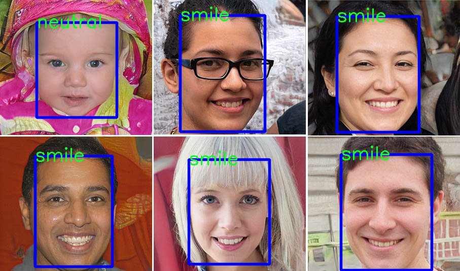

# Face_emotion_recognition

pytorch 1.5.1
opencv 3.4.2

Face detection model : https://github.com/kairess/face_detection_comparison  OpenCV DNN Face Detector
Image classification : Efficientnet-b3

Emotion : neutral, anger, surprise, smile , sad

Result

